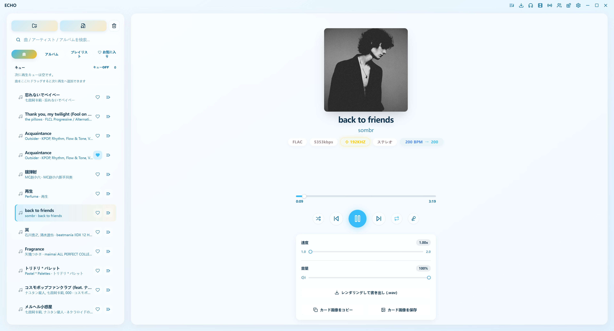

<div align="center">


<h3>ECHO · 你的 HiFi 桌面音乐播放器</h3>

<p>Electron + React 构建 · 原生音频引擎 · 沉浸式歌词 · 插件扩展</p>

<p>
  <a href="https://github.com/Moekotori/Echoes/releases/latest">
    
  </a>
  <a href="https://github.com/Moekotori/Echoes/releases">
    
  </a>
  
  
  
</p>


<p>
  <a href="https://github.com/Moekotori/Echoes/releases/latest"><strong>⬇ 下载最新版本</strong></a>
  &nbsp;·&nbsp;
  <a href="docs/plugin-development.md">插件开发</a>
  &nbsp;·&nbsp;
  <a href="#-快速开始">快速开始</a>
  &nbsp;·&nbsp;
  <a href="#-listen-together-服务端">联机听歌</a>
</p>

</div>

---

## 截图预览

<div align="center">

<br><br>

<br><br>

</div>


---

## ✨ 核心特性

<table>
  <tr>
    <td width="50%" valign="top">
      <h4>🎵 HiFi 音频引擎</h4>
      原生音频宿主 <code>echo-audio-host</code> 独立进程运行，支持 Windows WASAPI 独占模式与 ASIO 设备切换，实现比特完美输出。内置 16 段参数均衡器与 Preamp，实时生效，零妥协。
    </td>
    <td width="50%" valign="top">
      <h4>🎤 沉浸式歌词</h4>
      支持逐行与逐字（卡拉 OK 风格）同步高亮，自动从 NetEase / LRCLIB 抓取歌词，Kuroshiro 驱动的日语罗马音转换，以及可悬浮在任何窗口之上的桌面歌词。
    </td>
  </tr>
  <tr>
    <td valign="top">
      <h4>🎬 MV 联动</h4>
      播放时自动匹配 YouTube 或 Bilibili MV，支持全屏背景模式、画质切换、偏移校准与失败自动回退。沉浸式体验，和流媒体一样好看。
    </td>
    <td valign="top">
      <h4>👥 一起听</h4>
      基于 WebSocket 的房间同步方案，支持自托管服务端与 Token 鉴权。同时支持 DLNA 投流，把音频发送到局域网内的任意渲染设备。
    </td>
  </tr>
  <tr>
    <td valign="top">
      <h4>⬇ 媒体下载</h4>
      一键下载 YouTube、Bilibili、SoundCloud 音频，自动写入元数据与封面。支持网易云歌单批量导入，内置 NCM 格式转换器。
    </td>
    <td valign="top">
      <h4>🧩 插件 & 主题</h4>
      完整的沙箱化插件系统，支持扩展音乐源、歌词源、UI 面板与侧边栏。基于 CSS 变量的主题引擎，内置编辑器，支持导入 / 导出。
    </td>
  </tr>
</table>


### 更多特性一览

| 分类         | 内容                                                       |
| ------------ | ---------------------------------------------------------- |
| **曲库**     | 本地文件夹拖拽扫描、专辑视图、用户歌单、喜欢列表、播放队列 |
| **音频**     | 变速播放保持音高、交叉淡入淡出、睡眠定时器、实时频谱可视化 |
| **音频格式** | FLAC / DSD / MP3 / AAC 等主流格式，DSD 自动转换播放        |
| **系统集成** | Discord Rich Presence、系统托盘与媒体键、分享卡片图导出    |
| **界面**     | 英 / 简中 / 日语三语 UI，自定义背景 / 字体 / 圆角 / 模糊   |
| **稳定性**   | 崩溃上报、应用内日志查看、OTA 自动更新（GitHub Releases）  |

---

## 🛠 环境要求

| 依赖     | 版本                                          |
| -------- | --------------------------------------------- |
| Node.js  | `>= 18`（推荐 20 LTS）                        |
| npm      | `>= 9`                                        |
| 操作系统 | 开发建议 Windows，提供 macOS / Linux 构建脚本 |

> `.npmrc` 已配置镜像源，适合中国大陆网络环境。原生模块会在 `postinstall` 时自动编译。

---

## 🚀 快速开始

```bash
# 克隆仓库
git clone https://github.com/Moekotori/Echoes.git
cd Echoes

# 安装依赖（原生模块自动编译）
npm install

# 启动开发环境（热重载）
npm run dev
```

> `(*´･ω･)ﾉ  就这三行，跑起来了。`

---

## 📦 构建打包

```bash
# Windows 安装包
npm run build:win

# Windows Release（含 electron-updater 所需的 .blockmap 与 latest.yml）
npm run build:win:release

# macOS
npm run build:mac

# Linux
npm run build:linux
```

其他常用命令：

```bash
npm run test:unit          # 单元测试
npm run verify:release     # 发布前校验
npm run theme:audit        # 主题变量审计
npm run build:audio-host   # 重新构建原生音频宿主
```

发布前请完整走一遍 [`docs/RELEASE_CHECKLIST.md`](./docs/RELEASE_CHECKLIST.md)。

---

## 🎧 Listen Together 服务端

仓库内附轻量 WebSocket 服务端，用于多人同步听歌。

```bash
cd server/listen-together
npm install
PORT=8787 npm start
```

生产环境（Nginx 反代 + PM2）部署：[`DEPLOY_FROM_ZERO_ZH.md`](./server/listen-together/DEPLOY_FROM_ZERO_ZH.md)

---

## 🧩 插件开发

ECHO 插件是一个包含 `plugin.json` 清单的文件夹，可扩展：

- 音乐源 / 歌词源
- 主进程能力（Node.js 沙箱）
- 渲染进程 UI 面板与侧边栏
- 插件私有存储

```
my-plugin/
├── plugin.json   # 插件清单（名称、版本、入口等）
├── main.js       # 主进程入口（可选）
├── renderer.js   # 渲染进程入口（可选）
└── styles.css    # 样式（可选）
```

完整 API 文档：[`docs/plugin-development.md`](./docs/plugin-development.md)  
示例插件：[`examples/`](./examples/)

---

## 📁 项目结构

```
src/
├── main/                 # Electron 主进程
│   ├── audio/            # 音频引擎 & 原生桥接 & VST
│   ├── cast/             # DLNA MediaRenderer
│   ├── plugins/          # 插件管理与沙箱
│   └── utils/            # 主进程工具
├── preload/              # contextBridge IPC 暴露层
└── renderer/src/
    ├── components/       # React 组件
    ├── config/           # 默认配置
    ├── locales/          # i18n（en / zh / ja）
    └── App.jsx           # 根组件

server/
└── listen-together/      # 联机听歌服务端

docs/                     # 开发文档
examples/                 # 示例插件
scripts/                  # 构建 & 发布脚本
```

---

## 🤝 参与贡献

欢迎 PR！提交前请确保：

1. Fork 仓库并基于 `main` 创建功能分支
2. 运行 `npm run lint` 与 `npm run format` 保持风格一致
3. PR 描述中说明：改了什么 · 为什么改 · 怎么验证

---

## ❓ 常见问题

<details>
<summary><b>为什么强调 WASAPI 独占 / HiFi？</b></summary>
目标是绕开系统混音器的重采样与音量干预，在 Windows 上以更干净的链路输出音频。是否真正比特完美取决于你的设备与驱动设置。
</details>


<details>
<summary><b>歌词支持卡拉 OK 逐字高亮吗？</b></summary>
支持。可以显示逐行 LRC 或逐字高亮（类 Apple Music 效果），同时支持翻译与日语罗马音。
</details>


<details>
<summary><b>"一起听"需要什么条件？</b></summary>
需要你或朋友自建 WebSocket 服务端（见上方说明），然后在客户端加入同一房间即可实时同步播放。
</details>


<details>
<summary><b>插件能做什么？</b></summary>
可以扩展音乐源、歌词源、UI 面板、侧边栏等，也可以通过主进程插件访问本地文件系统或调用外部 API。
</details>


---

## Special Thanks:

ECHO 建立在这些优秀的开源项目之上：

[Electron](https://www.electronjs.org/) · [React](https://react.dev/) · [electron-vite](https://electron-vite.org/) · [naudiodon](https://github.com/Streampunk/naudiodon) · [Kuroshiro](https://kuroshiro.org/) · [music-metadata](https://github.com/borewit/music-metadata) · [yt-dlp](https://github.com/yt-dlp/yt-dlp) · [FFmpeg](https://ffmpeg.org/) · [lucide-react](https://lucide.dev/)

---

<div align="center">
<sub>Made with ♪ by <a href="https://github.com/Moekotori">Moekotori</a></sub>
</div>

