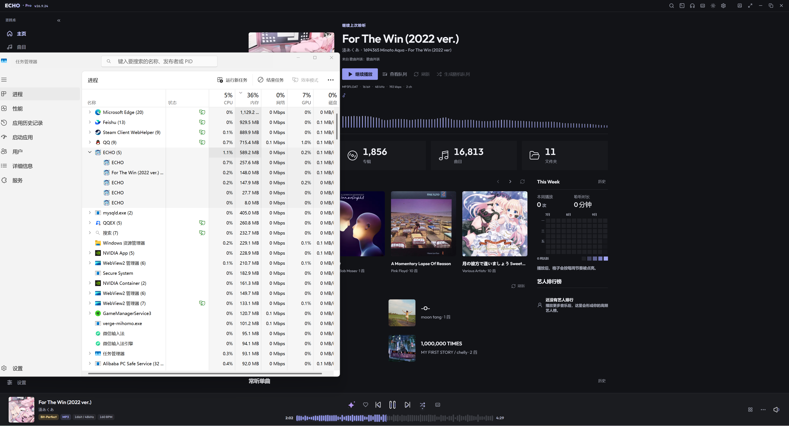
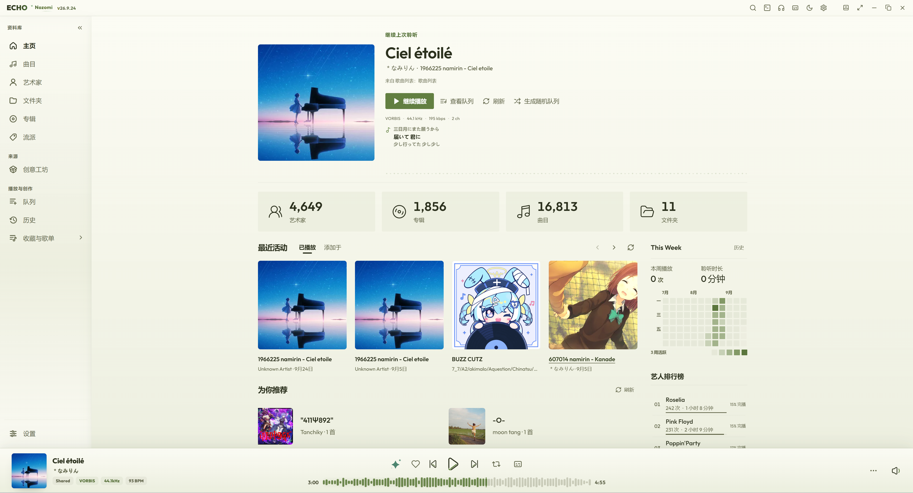
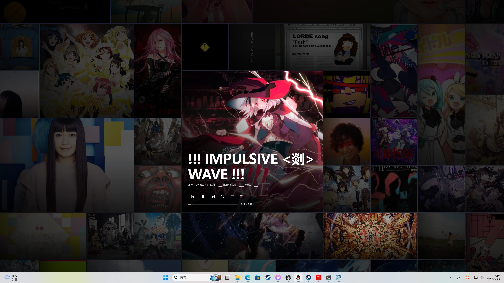
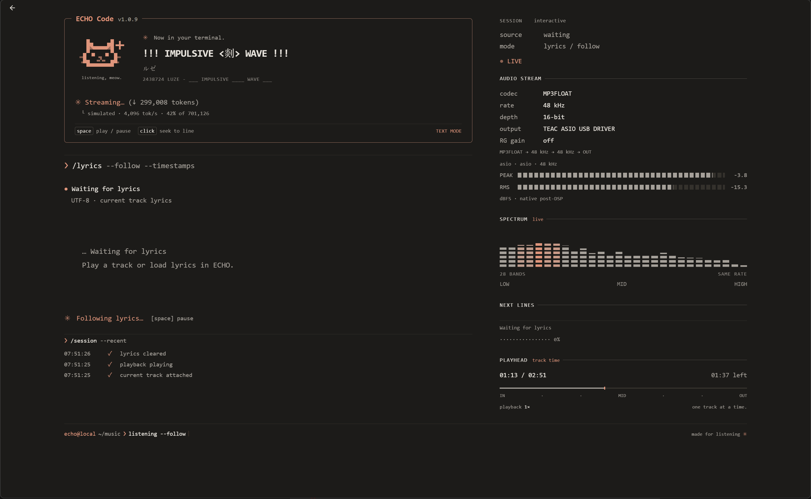

  

<h1 align="center">ECHO</h1>

<strong>让音乐库成为你的主场。</strong>

  为本地音乐而生的桌面播放器：认真管理每一首歌，也认真对待每一次播放。

  
  
  

  
  
  
  
  

  <a href="https://store.steampowered.com/app/5105090/ECHO/">在 Steam 了解 ECHO</a>
  &nbsp;·&nbsp;
  <a href="https://github.com/Moekotori/ECHO/releases">获取社区版</a>
  &nbsp;·&nbsp;
  <a href="https://echonext.moe/zh/docs/">使用文档</a>
  &nbsp;·&nbsp;
  <a href="./README_EN.md">English</a>

---

## 社区版：永久免费，源码公开

社区版**永久免费**，源码公开，维护依靠大家共同参与。欢迎从 [GitHub Releases](https://github.com/Moekotori/ECHO/releases) 获取播放器，一起修复问题、完善功能、改进文档与翻译。

## Steam 版：把听歌这件事，做得更尽兴

Steam 版保留以本地音乐为中心的播放体验，加入 Steam 更新、部分设置的 Cloud 同步、成就、好友状态和创意工坊。你可以从一张专辑封面开始，整理自己的曲库，再把歌词、视觉与桌面布置成喜欢的样子。

**以下四张图片均展示 Steam 版。**

### 01 / 16,813 首歌，照样轻装上阵

**16,813 首曲目、1,856 张专辑，播放中。**截图里的 Windows 任务管理器显示：ECHO 进程组 **589.2 MB 内存、1.1% CPU**。曲库扫描、元数据处理与播放各有明确职责；低配置模式和后台任务降载，让大曲库也能轻快打开。

### 02 / 你的曲库，你的审美

封面、专辑、艺术家、最近播放、歌词和队列集中在同一套桌面界面里。深色、浅色与不同风格的主题让音乐库随着你的喜好变化；播放栏始终在手边，想听哪首歌，不必在层层窗口里寻找。

### 03 / 让桌面随音乐呼吸

让专辑封面铺满桌面，让当前曲目、进度与音频可视化跟着音乐变化。ECHO 提供与 Wallpaper Engine 联动的桥接能力；壁纸创作者也可以从仓库里的 [Web 壁纸示例](./examples/wallpaper-engine/echo-web-wallpaper/README.md) 开始制作自己的场景。

### 04 / 把播放器交给创作者

在 [Steam 创意工坊](https://steamcommunity.com/app/5105090/workshop/)探索并订阅社区作品：主题、歌词场景、可视化与扩展，让同一首歌有不同的打开方式。下图的 **ECHO Code** 把歌词跟随、播放进度、音频流信息和实时频谱排成一块可交互的终端面板。

### 还可以更深入

| 想做的事 | ECHO 提供的能力 |
| --- | --- |
| 认真听自己的音乐 | 本地曲库、专辑与艺术家浏览、歌单、动态歌词和播放历史 |
| 选择合适的输出 | 系统输出、WASAPI Shared / Exclusive、ASIO，连接耳机、音箱与外置 DAC |
| 看见声音链路 | 编码、采样率、输出设备与处理状态一目了然 |
| 换一种听歌氛围 | 主题、可视化、壁纸联动以及创意工坊作品 |
| 接入 Steam | 更新、部分设置的 Cloud 同步、成就、好友状态与创意工坊 |

Audio Core 与原生宿主负责真实播放状态；输出模式、设备能力和回退原因都有据可查。界面负责呈现，也给每一次切换一个明确的结果。

  <strong>打开自己的音乐，听见自己的世界。</strong> 
  <a href="https://store.steampowered.com/app/5105090/ECHO/">前往 Steam 商店 →</a>

