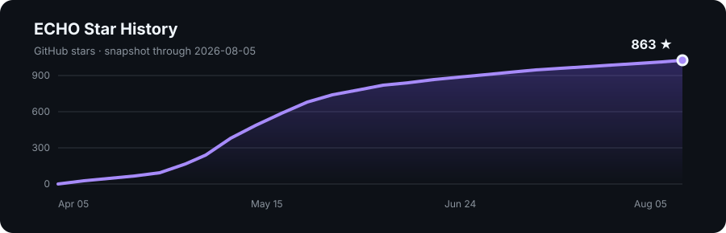

<p align="center">
  <a href="https://echonext.moe/zh/">
    
  </a>
</p>

<h1 align="center">ECHO Community</h1>

<p align="center">
  <strong>为本地音乐而生的桌面播放器</strong><br />
  专注曲库管理、稳定播放、HiFi 输出与长期使用体验
</p>

<p align="center">
  <a href="https://github.com/Moekotori/ECHO/stargazers">觉得 ECHO 还不错？给它点个 ★ Star 吧，我们会开心很久。</a>
</p>

<p align="center">
  
  
  
  
</p>

<p align="center">
  <a href="https://github.com/Moekotori/ECHO/releases">
    
  </a>
  <a href="https://github.com/Moekotori/ECHO">
    
  </a>
</p>

<p align="center">
  <a href="./README_EN.md">English</a>
  ·
  <a href="https://echonext.moe/zh/">官方网站</a>
  ·
  <a href="https://echonext.moe/zh/download/">下载社区版</a>
  ·
  <a href="https://store.steampowered.com/app/5105090/ECHO/">Steam</a>
  ·
  <a href="https://echonext.moe/zh/docs/">使用文档</a>
  ·
  <a href="https://echonext.moe/zh/changelog/">更新日志</a>
  ·
  <a href="https://github.com/Moekotori/ECHO/issues">问题反馈</a>
</p>

---

## 关于 ECHO 重新开源

前段时间，我们曾迫不得已将 ECHO 闭源。

在此之前，项目维护者遭到某位用户持续数月的辱骂与精神压迫，仓库也曾两次遭到破坏（感谢某位contributor毁坏两次仓库喵~）如果Github能删这个就好了。与此同时，甚至有人指责我们开源是为了“骗钱”。（尊贵的“柠檬起司”大人甚至试图破解开源软件。。真是低调的黑客...好害怕）这些事情让我们非常心寒，也让原本单纯的开源与分享变成了沉重的负担，因此我们一度选择关闭源码，保护项目和维护者。

但现在，我们改变主意了。

我们仍然相信开源、分享和社区的价值，也不希望少数人的恶意让所有真正喜欢 ECHO、愿意使用和共同建设它的人失去参与的机会。因此，**ECHO 已经重新开源**。源码在本仓库；开发文档和贡献方式还会继续整理。

### 给开发者的话

欢迎开发者参考、学习和借鉴 ECHO 的设计思路与实现。参考了 ECHO 的代码或设计，给项目留个名字或链接就好~ 这点小小的尊重会让开源社区更舒服。具体使用、复制和分发仍请遵守仓库中的许可证。

同时请注意：**任何大型 PR 都不会被合并。** 社区版现在主要靠大家一起养。发现 bug 可以自己修，先开 Issue 说清楚，再发范围小、能审查的 Pull Request。

感谢每一位善意使用、认真反馈、帮助测试和参与贡献的朋友。希望这一次，我们可以一起让 ECHO 走得更远。

## 社区版是什么

这个仓库是 **ECHO Community**，也就是社区版。

它是开源、可自行构建和分发的桌面播放器：本地曲库、稳定播放、HiFi 输出、DSP，以及社区版里已经有的远程库、插件等能力，都还在。它**不是** Steam 版的完整拷贝，也没有创意工坊那套生态。

接下来我们会**降低社区版的更新频率**。官方重心转向 Steam 版；社区版交给大家一起维护。遇到 bug，欢迎自己动手修，然后提交 Pull Request。严重问题我们仍会看，但不要再把社区版当成每周必更的官方主线。

想体验完整生态（创意工坊、主题、歌词场景、可视化、DSP 预设，以及持续的官方更新），请购买 **ECHO Steam Ver.**：

<p align="center">
  <a href="https://store.steampowered.com/app/5105090/ECHO/"><strong>购买 ECHO Steam Ver. →</strong></a>
</p>

别把两份东西混成同一个仓库。社区版功能更全、节奏更慢、靠 PR 养活；Steam 版更克制，但有工坊生态和官方更新主线。至于回本（圈钱）……对，完整生态请走 Steam。

| | Community（本仓库） | ECHO Steam Ver. |
| :--- | :--- | :--- |
| 定位 | 开源社区版，由大家维护 | 本地优先的完整生态发行版 |
| 更新 | 降低频率；修 bug 请自己 PR | 官方更新主线 |
| 许可 / 源码 | 本仓库，`LGPL-3.0-only` | 独立装配，按 Steam 发布边界裁剪 |
| 本地曲库 / DSP / HiFi 输出 | 有 | 有 |
| 远程曲库 | 有 | 有（用户自己的网盘 / NAS / 媒体库） |
| 第三方音乐平台 / 下载器 / 在线 MV | 社区版可保留既有能力 | 不提供 |
| 创意工坊 | 无 | 主题、歌词场景、可视化、DSP 等 |
| 当前平台 | 以本仓库发布说明为准 | 当前发布主线是 Windows；Linux / macOS 还不能当成 Steam 已支持 |

2026 年 8 月 15 日前购入 ECHO Pro 的朋友，仍按当时承诺处理 Steam CD Key、贡献者名单和周边；这档限时权益已经结束。现在请直接买 [ECHO Steam Ver.](https://store.steampowered.com/app/5105090/ECHO/)，或继续通过 [爱发电](https://www.ifdian.net/a/echonext) 支持项目。

---

## 认识 ECHO NEXT

ECHO是功能最全面的音乐播放器、（自信）

（如果有比我还全的 我要做高调的黑客了。）

### 为什么是 NEXT？

「ECHO NEXT」の NEXT は、Ado の楽曲『新時代』から取りました。

它不只是给旧 ECHO 加一个新名字。老版本在大曲库、长时间运行和功能不断叠加时，确实暴露过严重的性能问题：播放、界面、扫描和状态更新互相牵扯，代码也越堆越像一座不太好下脚的山。说得直白一点，老 ECHO 有性能问题，也有屎山问题(虽然NEXT也有很多屎山。但比老版本强一千倍)。

NEXT 是一次把基础重新理顺的尝试：保留喜欢的功能，也把性能、稳定性、模块边界和原生播放链路当成真正的产品能力，而不是以后再说的 TODO。

| LOCAL LIBRARY | DSP CENTER | NATIVE OUTPUT |
| :--- | :--- | :--- |
| 文件夹扫描、SQLite 曲库、标签、封面、专辑墙与播放列表 | 参数 EQ、Headroom、FIR、OPRA、声道工具与输出安全 | WASAPI Shared / Exclusive、ASIO、DSD / DoP 与 HQPlayer |

> [!NOTE]
> 源码已经公开；许可证和第三方材料以仓库当前文件为准。

## ECHO Audio Engine

ECHO 不把整条音频链路塞进一个“音质增强”按钮。输入、处理模块、采样率、输出模式、设备状态和回退原因都该看得见。

本地文件播放走 host-centered 的原生数据面：文件读取、libav 解码、ECHO SRC、Dither、SDM、FIFO、设备输出和 drain 判定由 `echo-audio-host` 持有；Electron 主进程负责输出计划、控制命令和状态解释，界面只负责展示与操作。播放位置以原生输出 frame counter 为准，解码器读完文件不等于歌曲已经播放结束。

```text
LOCAL FILE
    |
libav decode in echo-audio-host
    |
PCM -> ReplayGain / Headroom / EQ / FIR / Channel Tools
    |
ECHO SRC / Dither / ECHO SDM when explicitly enabled
    |
native FIFO, output clock and drain detection
    |
WASAPI Shared / Exclusive / ASIO / HQPlayer
    |
DAC
```

处理可以逐层打开，也可以全关。想调音时，ECHO 会告诉你声音经过了什么；想直出时，就把它们旁路。远程 URL、CUE、带特殊 headers 的请求和部分 gapless / automix chained playback 仍走兼容路径；不能用原生 DSP 时会直接说，绝不装作已经生效。

## Daemon 与 Native Scanner

### 新播放架构：让播放留在该待的地方

`echo-audio-host` 会常驻接手本地文件读取、libav 解码、预取、FIFO、DSP、设备输出和播放收尾；主进程通过 JSON-RPC 发出明确的打开、播放、暂停、seek、停止和队列命令，界面只负责控制和显示。

这样做最实际的好处是：扫封面、写数据库、React 重渲染，甚至主进程偶尔忙一下，都不该把正在播放的 PCM 一起拖住。输出时钟、缓冲尾部和 `ended` 都由 host 说了算，自动下一首不用再靠前端猜时间。

### Native Scanner：大曲库性能高手

`echo-native-scanner` 是随应用打包的 C++  Scanner，负责目录扫描和音频元数据读取，再把结果以结构化数据交回曲库；扫描、重扫、基准和 smoke 都有独立入口。

它的意义不只是“更快”三个字：导入几万首歌时，界面不必替重 I/O 和格式探测硬抗。现有兼容路径仍在，遇到不适用的格式或环境会回退或报出原因；

### Electron 不是犯罪

ECHO 不是浏览器播放器，也不是网页端套个窗口。Electron 是我们的桌面壳和前端运行时：React 的组件化、可视化、热更新、跨平台窗口和迭代速度，都让播放器界面可以认真做。

真正吃重的部分已经不在网页里：音频 daemon、native scanner、WASAPI / ASIO、DSD、DSP 和系统集成各做各的事。用 Electron 不是杀人；不要在说为什么不用Tauri了，它给前端带来的收益很大，对个人开发者很有帮助。此外，轻量化并不是我们的主要路线。

## DSP Center

DSP Center 把常常要一起用的 EQ、余量、耳机校正、FIR 和声道工具放在一个地方，想开就开，想关就关。

<p align="center">
  
  
</p>

<p align="center">
  
  
</p>

| 模块 | 能力 |
| :--- | :--- |
| Parametric EQ | Simple 模式快速塑造 Bass、Vocal、Air、Warm；Pro 模式保留频率、增益、Q 值与 Preamp 精调 |
| Headroom / Output Safety | Auto Gain、前级余量、削波风险和输出安全状态进入同一套工作流 |
| OPRA Headphone Correction | 按品牌和型号选择耳机校正曲线，并保留 A/B 与旁路判断 |
| FIR / Room Correction | 导入 IR，管理 Trim、延迟和卷积处理前后的安全余量 |
| Channel Tools | 左右声道增益、平衡、延迟差、Mono 与声道交换 |
| APO Import / Export | 连接已有 Equalizer APO 配置与 ECHO 的 DSP 工作流 |

EQ、FIR、ReplayGain、声道工具和重采样只要参与处理，就不再算 bit-perfect。把它们全旁路后，且输出格式没有别的问题，状态才会回来。开着 DSP 还自称直通，没这个选项。

[阅读 DSP 新手教程](https://echonext.moe/zh/docs/audio-output/dsp-beginner/) · [阅读 EQ 指南](https://echonext.moe/zh/docs/audio-output/eq/)

## PCM 与 ECHO SRC

ECHO SRC 是 PCM 采样率转换链路。它按 44.1 kHz 和 48 kHz 两个家族规划目标，不会把所有歌硬塞进同一个输出格式。

```text
PCM INPUT
    |
ECHO FIR / SAMPLE RATE CONVERSION
    |
2x PCM / 4x PCM / 8x Ultra
    |
WASAPI EXCLUSIVE or OFFICIAL ASIO
    |
DAC
```

| 维度 | ECHO SRC |
| :--- | :--- |
| 倍率 | 2x PCM、4x PCM、8x Ultra；源采样率已经达到目标时可以旁路 |
| 质量策略 | Balanced、Transparent、Low latency |
| 滤波与精度 | 普通模式提供可靠起点，高级模式开放 Filter、Quality Ladder、Dither 与 Noise Shaping |
| 计算路径 | 本地原生播放由 native CPU 路径执行；CUDA worker 还在，但不会把 CPU fallback 冒充成 CUDA 已启用 |
| 状态反馈 | 显示源采样率、目标采样率、引擎、质量策略、精度与当前路径 |
| 输出要求 | 验证升频时使用 WASAPI Exclusive 或 DAC 厂商官方 ASIO，并由真实 DAC 状态确认结果 |

升频会重算 PCM 采样点，所以不是 bit-perfect。它不会凭空造出细节，倍率也不是越高越好；算法、驱动、DAC 和整条链路能不能稳定才更重要。

[了解 ECHO SRC 与安全升频](https://echonext.moe/zh/docs/audio-output/upsampling/)

## SDM 与 ECHO Audio Lab

> [!NOTE]
> ECHO SDM 当前属于研发预览。它是独立于 PCM 升频和原生 DSD 直出的实验链路，不应被理解为所有设备上默认可用的正式能力。

ECHO SDM 探索的是从 PCM 到 Sigma-Delta Modulation 的完整处理路径：

```text
PCM INPUT
    |
OVERSAMPLING / FIR
    |
SIGMA-DELTA MODULATION
    |
NOISE SHAPING
    |
DSD / SDM OUTPUT FOR A SUPPORTED DAC
```

它把过采样、滤波、调制和噪声整形串在一起；本地 direct path 的调制与输出路由都在 native host 内完成，目前以 CPU 路径为准。先把普通 PCM 播稳，再碰这条链路。设备或驱动不满足条件时，它会回到 PCM，并告诉你为什么。

[查看 ECHO Pro 技术预览](https://echonext.moe/zh/pro/)

## PCM、SRC、SDM 与 DSD

| 路径 | 输入 | 发生了什么 | 输出目标 |
| :--- | :--- | :--- | :--- |
| Native PCM | PCM | 不启用额外 DSP 时尽量保持直接输出 | PCM DAC path |
| ECHO SRC | PCM | FIR 与采样率转换，生成新的 PCM 采样点 | 更高采样率 PCM |
| ECHO SDM | PCM | 过采样、滤波、Sigma-Delta 调制与噪声整形 | 支持设备上的 DSD / SDM，研发预览 |
| DSD Direct | DSF / DFF | 通过 DoP 封装或厂商官方 ASIO Native DSD 传输 | DAC 的 DSD 接收路径 |

ECHO NEXT 会把这四条路径分开表达。PCM 升频不冒充 DSD，PCM→SDM 不冒充原生 DSD 文件直出，界面显示 ASIO 也不等于 DAC 一定收到了 Native DSD。

## 原生输出与设备链路

| 输出方式 | 适合场景 | 边界 |
| :--- | :--- | :--- |
| System / WASAPI Shared | 日常稳定播放、蓝牙、系统混音与快速排障 | 最兼容，但最终格式可能由系统混音器决定 |
| WASAPI Exclusive | 绕开共享混音、按曲目或 DSP 目标打开 DAC | 设备会被独占，更依赖驱动和 DAC 能力 |
| ASIO | 厂商官方驱动、专业声卡、低延迟与 Native DSD 场景 | 不把 ASIO4ALL 等包装层等同于厂商原生能力 |
| DSD over PCM | 让支持 DoP 的 DAC 从 PCM 外观帧中还原 DSD | 链路不能对承载数据做音量、混音或重采样 |
| ASIO Native DSD | 向明确支持的 DAC 传递原生 DSD | 属于实验能力，需要厂商官方驱动与严格音量安全 |
| HQPlayer | 将曲库和播放控制交给 ECHO，高阶滤波与调制交给专用引擎 | 实际能力取决于 HQPlayer、NAA、DAC 与网络链路 |

DSD 播放时，数字音量、EQ、ReplayGain 和普通 PCM DSP 会破坏直出目标。ECHO 因此强调满刻度数字音量、DAC 或前级控制实际响度、官方驱动、真实设备指示和明确回退，而不是只看软件里有没有“DSD”三个字。

[阅读 DSD 播放教程](https://echonext.moe/zh/docs/audio-output/dsd/) · [比较 WASAPI Exclusive 与 ASIO](https://echonext.moe/zh/docs/audio-output/asio-vs-exclusive/)

## 音频之外，仍然是一台完整的音乐播放器

| 能力层 | 功能范围 |
| :--- | :--- |
| 本地曲库 | 文件夹导入、SQLite 曲库、标签读取、封面缓存、专辑、艺术家、收藏、历史、播放列表与重复歌曲筛选 |
| 歌词与 MV | 本地与在线候选、翻译、罗马音、歌词偏移、桌面歌词、沉浸播放页与 MV 匹配 |
| 远程来源 | WebDAV、SMB、Jellyfin、Emby、Subsonic、Navidrome 与受控的远程索引和播放 |
| 插件扩展 | 插件、下载器、网络元数据与后台任务运行在清晰的权限和诊断边界内 |
| 长期维护 | 日志、崩溃恢复、曲库健康、缓存迁移、设置备份和危险操作确认 |

## 快速入口

| 你想要…… | 前往 |
| :--- | :--- |
| 获取最新社区版 | [官方下载页](https://echonext.moe/zh/download/) · [GitHub Releases](https://github.com/Moekotori/ECHO/releases/latest) |
| 体验完整生态 | [购买 ECHO Steam Ver.](https://store.steampowered.com/app/5105090/ECHO/) |
| 第一次使用 ECHO NEXT | [使用文档](https://echonext.moe/zh/docs/) |
| 了解最近发生了什么 | [更新日志](https://echonext.moe/zh/changelog/) |
| 报告问题或提出建议 | [GitHub Issues](https://github.com/Moekotori/ECHO/issues) |
| 支持项目长期开发 | [ECHO Pro](https://www.ifdian.net/a/echonext) |
| 提交你期待的新功能 | [ECHO 许愿池](https://docs.qq.com/form/page/DYkt1UVNuaEpHcFB5) |
| 参与安卓开发 | [ECHO Android](https://github.com/Moekotori/ECHOAndroid) |

## 还在做什么

社区版会降低更新频率，日常修 bug 请尽量自己改并发 Pull Request。官方主线在 Steam 版。没有把社区版写成宏大路线图；进度以[更新日志](https://echonext.moe/zh/changelog/)和发布说明为准。

## ECHO Pro

ECHO Pro 是给愿意长期支持 ECHO 的朋友准备的。收到的支持会用在基础设施、测试设备、设计和持续开发上。

权益和实验功能会随版本调整，具体以官方页面为准。

<p align="center">
  <span title="如果你不想开 Pro 但想体验 Pro 的权益，这个项目是开源的。所以……（不用我说得更明白了吧？！）">████████████████████████████████████████</span>
</p>

<p align="center">
  <a href="https://www.ifdian.net/a/echonext"><strong>支持 ECHO NEXT · 了解 ECHO Pro →</strong></a>
</p>

## 参与 ECHO Android 开发

ECHO Android 是 ECHO 的 Android 客户端项目。想参与移动端播放器、曲库、同步、播放体验或平台适配开发，可以直接前往仓库了解进展并提交 Issue 或 PR。

<p align="center">
  <a href="https://github.com/Moekotori/ECHOAndroid"><strong>前往 ECHO Android 参与开发 →</strong></a>
</p>

## 反馈问题

提 Issue 前先读 [Issue 规范](./.github/ISSUE_POLICY.md)。**必须先公开 Star 本仓库**；流媒体 / 第三方音乐平台相关内容和找茬内容会被自动关闭，也不会回复。

如果你遇到异常，请先确认正在使用最新版本，再通过 [GitHub Issues](https://github.com/Moekotori/ECHO/issues) 提交反馈。信息越完整，问题通常越容易被定位：

- ECHO NEXT 版本与下载渠道；
- 操作系统版本和设备信息；
- 清晰、可重复的操作步骤；
- 预期结果与实际结果；
- 必要的截图、日志或录屏。

提交前请移除账号、令牌、本机隐私路径和其他敏感信息。功能建议也欢迎通过 Issues 提出，但是否实现及具体排期以维护计划为准。

## License

本仓库采用 [GNU Lesser General Public License v3.0](./LICENSE)，对应 SPDX 标识 `LGPL-3.0-only`；第三方材料仍遵循各自的许可条款。

简单说：你可以使用、学习、修改和分发 ECHO；如果分发了修改过的 ECHO，则需要保留 LGPL 许可，并让接收者能取得对应的 ECHO 源码与修改内容。别把改过的 ECHO 锁成闭源黑盒就好。参考了 ECHO 的代码或设计，也请在项目里留个名字或链接~ 完整权利与义务仍以 [LICENSE](./LICENSE) 为准。

## 技术致敬

ECHO 的很多能力不是凭空出现的，向这些优秀的开源项目、音频技术与标准致敬：

| 项目 / 技术 | 在 ECHO 中做什么 |
| :--- | :--- |
| [FFmpeg](https://ffmpeg.org/) / libav | 音频解码与媒体处理基础设施 |
| [SoX Resampler / libsoxr](https://sourceforge.net/projects/soxr/) | 高质量 PCM 重采样的参考与可用后端 |
| [SQLite](https://sqlite.org/) / [better-sqlite3](https://github.com/WiseLibs/better-sqlite3) | 本地曲库与索引存储 |
| [TagLib](https://taglib.org/) / [music-metadata](https://github.com/Borewit/music-metadata) | 音频标签、封面与元数据读取 |
| [Electron](https://www.electronjs.org/) / [React](https://react.dev/) | 桌面壳、界面与交互开发体验 |
| [WASAPI](https://learn.microsoft.com/windows/win32/coreaudio/wasapi) / [ASIO](https://www.steinberg.net/asio/) | Windows 音频设备与低延迟输出能力 |
| [NVIDIA CUDA](https://developer.nvidia.com/cuda-toolkit) | ECHO SRC 的可选计算路径 |

ECHO SRC、ECHO SDM、dither、噪声整形、FIFO 与输出调度是项目自己的实现和取舍；它们也站在长期音频工程经验与这些技术基础之上。谢谢每一位把工具、标准和知识留给后来者的人。

---

<p align="center">
  感谢每一位仍在使用、测试、反馈和支持 ECHO NEXT 的朋友。<br />
  <strong>项目会以新的方式，继续向前。</strong>
</p>

## Star History

<p align="center">
  <a href="https://www.star-history.com/#Moekotori/ECHO&Date">
    
  </a>
</p>

## 小小声明

<p align="center">
  
</p>

大大方方承认：ECHO 的开发里用了 AI。它会帮我查资料、整理思路、写掉一些重复劳动；但代码能不能跑、声音会不会出问题、设备会不会翻脸，最后还是要靠测试、日志、真机和我自己一点点收拾。目前我对ECHO的质量还是很肯定的，我能确保这可以端给大家！

我是个人开发者，做得不完美的地方请多多包涵。作者吃软不吃硬：带着复现步骤、日志和正常语气来反馈，我会认真看、认真修；如果用喷人的语气反馈问题，那我一定会喷回去的。（真的会。）

### 联系作者

- Email: [nyafairy233@gmail.com](mailto:nyafairy233@gmail.com)
- Discord: `Moekotori`

### 流媒体免责声明

ECHO 是本地优先的音乐播放器，不是盗版分发工具，也不替任何第三方流媒体平台提供内容或授权。涉及第三方服务时，账号、内容与使用权限均由用户自行依法取得并遵守对应平台的规则。

ECHO 不会提供超出合法使用范围、侵害音乐人、版权方或平台权益的功能：不绕过访问控制，不破解平台限制，不提供未授权下载歌曲、规避付费权益或其他侵权能力。
