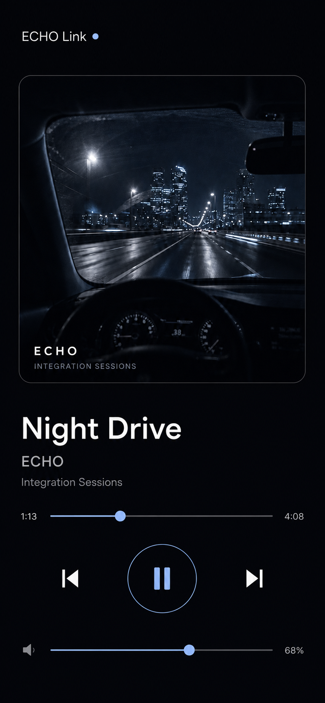

# ECHO 万物互联：跨电脑开发交接记忆

> 导出时间：2026-07-17（Asia/Hong_Kong）  
> 仓库：`https://github.com/Moekotori/ECHODev.git`  
> 分支：`main`  
> 导出时远端基线：`9198ff9 Fix gapless smoke sample-rate routing`

这份文档用于在另一台电脑上无缝继续 ECHO 万物互联。先拉取 `main`，再读本文和 [`ECHO_LINK_V2.md`](./ECHO_LINK_V2.md)，不要重新猜架构。

## 一句话目标

让 ECHO 成为可信局域网里的音乐联动核心：Audio Host 永远是播放真源，所有外部设备只通过统一的语义事件出口和 provider-aware 动作入口联动。

## 回家后最快续上

```powershell
git clone https://github.com/Moekotori/ECHODev.git
cd ECHODev
git pull origin main
npm install
npm run typecheck
```

如果依赖已经存在：

```powershell
npm run doctor
npm run build:quick
```

推荐新工作分支：

```powershell
git switch -c codex/echo-everything-wave2
```

## 当前已经完成

### 1. Integration Core

- `IntegrationEventHub` 只订阅一次 AudioSession。
- 对外快照包含播放状态、基础曲目信息、位置、时长、音量和输出摘要。
- 不对外暴露音频文件路径、解码器细节和 native host 内部状态。
- 状态、换曲、音量、输出变化立即发布。
- 进度事件 latest-wins，最多每 500 ms 一次。
- 新订阅者先收到完整 snapshot；断线重连重新同步，不做历史回放。
- Stage 已迁移到 EventHub；Wallpaper Engine 高频遥测仍保持原链路。

关键文件：

- `src/main/integrations/core/IntegrationEventHub.ts`
- `src/shared/types/integrationPlatform.ts`
- `src/main/integrations/stage/StageBridgeService.ts`

### 2. 统一播放动作入口

- `IntegrationActionRouter` 支持：
  - `play`
  - `pause`
  - `stop`
  - `previous`
  - `next`
  - `seek`
  - `setVolume`
- `MainWindowPlaybackCommandRelay` 与现有 IPC 共用请求/响应、15 秒超时和错误语义。
- 真正的控制仍由 Renderer 的 provider-aware `PlaybackCommandController` 执行。
- Connect、Spotify、本地播放继续走各自正确控制面。
- 外部联动不得绕过它们直接操作 AudioSession。
- v2 动作带 `requestId`，按客户端缓存五分钟，避免重试造成重复切歌。

关键文件：

- `src/main/integrations/core/IntegrationActionRouter.ts`
- `src/main/playback/MainWindowPlaybackCommandRelay.ts`
- `src/renderer/components/player/PlaybackCommandController.ts`

### 3. ECHO Link v2 Basic

- 与 v1 共用端口 `26789` 和 mDNS。
- `legacyV1Enabled`、`basicV2Enabled` 独立控制；任一启用时共享 gateway 继续运行。
- Basic 免费开放，无 Pro gate，默认关闭，用户主动启用。
- 一次只允许一个两分钟配对会话。
- 服务端只保存 SHA-256 token hash，不保存明文 token 或 pairing secret。
- 最多 32 个客户端，可单独撤销；撤销后现有 SSE 立即关闭。
- scopes 固定为：
  - `status:read`
  - `events:read`
  - `playback:control`

当前接口：

| 接口 | 用途 |
|---|---|
| `GET /echo-link/v2/remote` | 同源手机遥控器 |
| `POST /echo-link/v2/pair` | 两分钟凭证换取一次性 access token |
| `GET /echo-link/v2/status` | 脱敏播放快照与能力 |
| `GET /echo-link/v2/artwork/current` | Bearer 鉴权的当前歌曲封面字节 |
| `POST /echo-link/v2/actions/playback` | 基础播放动作 |
| `POST /echo-link/v2/events/ticket` | 生成 60 秒 EventSource ticket |
| `GET /echo-link/v2/events` | snapshot-first SSE 与 15 秒 heartbeat |

安全边界：

- v2 只接受 loopback/局域网请求。
- token 不进入 URL、状态、日志或诊断。
- EventSource 使用短期 ticket。
- JSON body 上限 16 KiB。
- 配对、动作和 SSE 均有限流。
- 当前封面接口只返回图片字节，不返回本地路径或上游 URL。
- 封面限制安全图片类型、10 MiB 大小和八秒远端读取超时。
- `file://` 和普通 HTTP artwork metadata 不会被代理。
- v1 的旧 token、URL、媒体、曲库和队列行为保持兼容。

关键文件：

- `src/main/connect/EchoLinkService.ts`
- `src/main/connect/EchoLinkV2Service.ts`
- `src/main/connect/EchoLinkV2ClientStore.ts`
- `src/main/connect/EchoLinkV2Artwork.ts`
- `src/main/connect/EchoLinkBasicIntegration.ts`
- `src/main/ipc/echoLinkIpc.ts`

### 4. Mobile Remote

手机端已经从功能卡片改成专注遥控器：

- 当前歌曲真实方形封面。
- 大标题、艺术家、专辑。
- 进度与时间。
- 上一首、播放/暂停、下一首。
- 音量。
- 不展示 stop、刷新、输出设备、曲库、队列或设备管理。
- Bearer token 存 IndexedDB。
- 配对 URI 只在 URL fragment 中出现，解析后立即清除。
- 封面通过 Bearer 请求后转为 Blob URL。
- token 失效或设备被撤销后清除本机凭证并要求重新扫码。

设计定稿：

- 背景：`#080A0F`
- 主文字：`#F4F5F7`
- 石墨灰：`#2B2F38`
- 冰蓝强调：`#7CB7FF`
- 禁止绿色、紫色霓虹、装饰渐变、HUD 和“AI 科技感”。
- 字体方向：`Outfit`，标题建议 `700–800`，字距约 `-0.05em`。
- 仓库已安装 `@fontsource/outfit`。

关键文件：

- `src/main/connect/EchoLinkMobileRemote.ts`
- `src/main/connect/EchoLinkMobileRemote.test.ts`
- `artifacts/design-qa/echo-link-mobile-remote-implementation.png`
- `artifacts/design-qa/echo-link-mobile-remote-comparison.jpg`

相关提交：

- `2ebe380 Add same-origin mobile remote to ECHO Link Basic`
- `17227ce Polish ECHO Link mobile remote`

## 视觉资产

### ECHO 万物互联三语横图


文案定稿：

```text
ECHO 万物互联
EVERYTHING, CONNECTED.
すべてがつながる。
```

### Mobile Remote 选中稿



注意：夜景只是设计稿里的测试封面，不得写死进产品。生产页面必须显示当前歌曲真实封面。

## 已完成验证

2026-07-17 最后一轮相关测试：

- Integration Core、v2、v1、Stage、IPC：`43/43` 通过。
- MainWindow Relay、provider-aware Playback Controller：`4/4` 通过。
- 合计：`47/47` 通过。
- `npm run typecheck`：通过。
- Mobile Remote 390 × 844 浏览器验收：
  - 无横向溢出。
  - pairing fragment 已清除。
  - 当前封面加载成功。
  - previous、next、pause、seek、setVolume 都发出正确请求。
  - 浏览器 console 无错误。

复跑命令：

```powershell
$env:ECHO_SKIP_NATIVE_ABI='1'
npx vitest run `
  src/main/integrations/core/IntegrationEventHub.test.ts `
  src/main/integrations/core/IntegrationActionRouter.test.ts `
  src/main/connect/EchoLinkMobileRemote.test.ts `
  src/main/connect/EchoLinkV2Artwork.test.ts `
  src/main/connect/EchoLinkV2Service.test.ts `
  src/main/connect/EchoLinkService.test.ts `
  src/main/integrations/stage/StageBridgeService.test.ts `
  src/main/ipc/echoLinkIpc.test.ts `
  src/main/playback/MainWindowPlaybackCommandRelay.test.ts `
  src/renderer/components/player/PlaybackCommandController.integration.test.tsx
```

然后：

```powershell
npm run typecheck
npm run build:quick
```

本阶段不改 native host，因此联动工作不要顺手运行 audio-host 全量构建或长时间 ctest。

## 第一波实机验收已完成

2026-07-22 用户确认“手机 → 正在运行的 ECHO → 当前播放源”基础闭环实机验收已经完成。以下矩阵保留为后续回归清单，不再作为当前开发阻塞项。此次验收之后新增的睡眠恢复与添加到主屏幕能力仍需一次 focused 实机回归：

1. 启动 ECHO。
2. 设置 → 集成 → 启用 ECHO Link Basic。
3. 手机与电脑接入同一可信局域网。
4. 生成二维码并扫码。
5. 验证封面、状态、SSE、上一首、播放/暂停、下一首、Seek、音量。
6. 在电脑端撤销手机，确认手机立即失去状态、封面和 SSE 访问。
7. 关闭 Basic，确认 v2 停止；如果 v1 仍启用，共享服务器不能被误关。
8. 记录不同 provider：本地、Spotify、Connect 至少各测一次。

## 第二波建议：真正开始“联动万物”

先做共同底座，再接具体生态，避免每种集成都直接碰 AudioSession。

### P0：真实设备闭环

- 手机实机矩阵已完成；后续改动按上述清单做 focused 回归。
- Mobile Remote 已补手机后台、重新联网和睡眠后的主动状态校准与事件流重建；真实网络地址和封面问题继续按实机反馈处理。
- Mobile Remote 已增加 PWA manifest、独立图标与添加到主屏幕引导，没有增加复杂控制功能。
- 保持“少功能、非常好用”的产品方向。

### P1：Integration Adapter Runtime

定义统一 adapter 生命周期：

```ts
type IntegrationAdapter = {
  id: string;
  start(context: IntegrationAdapterContext): Promise<void>;
  stop(): Promise<void>;
};
```

adapter 只能：

- 订阅 `IntegrationEventHub`。
- 通过 `IntegrationActionRouter` 发起动作。
- 声明 scopes、速率和诊断摘要。

adapter 禁止：

- 直接订阅 AudioSession。
- 直接操作 native host。
- 读取文件路径。
- 绕过 provider-aware Controller。

### P2：MQTT + Home Assistant（2026-07-28 已进入实现）

优先顺序建议：

1. MQTT 本地 adapter：已实现。
2. Home Assistant MQTT Device Discovery：已实现为官方支持的 `sensor`、`number`、`button` 组件。
3. Node-RED 可直接消费相同 topic：协议已稳定，见 `docs/ECHO_MQTT_INTEGRATION.md`。
4. 原生 `media_player`：自定义集成已实现于 `integrations/home-assistant/custom_components/echo_next`。
5. 再考虑 outbound webhook。

> Home Assistant 2026.7 的 MQTT Discovery 支持列表没有 `media_player`。因此第一版不会发布无效的
> `homeassistant/media_player/.../config`；MQTT Device Discovery 会发现一个 ECHO 设备并提供基础组件，
> 原生 `media_player` 则由仓库内的 Home Assistant 自定义集成提供。官方支持列表：
> https://www.home-assistant.io/integrations/mqtt/

建议 topic：

```text
echo/<deviceId>/state
echo/<deviceId>/event
echo/<deviceId>/command
echo/<deviceId>/result/<clientId>/<requestId>
echo/<deviceId>/availability
```

安全原则：

- 默认关闭，用户主动启用。
- broker 密码进入系统安全存储。
- command 必须有 requestId 和客户端身份。
- 保留去重、限流与明确错误。
- 不通过 MQTT 发送文件路径、access token 或原始媒体。

当前实现：

- `src/main/integrations/core/IntegrationAdapterRuntime.ts`
- `src/main/integrations/mqtt/MqttIntegrationAdapter.ts`
- `src/main/integrations/mqtt/MqttIntegrationService.ts`
- `src/main/integrations/mqtt/MqttCredentialStore.ts`
- `src/main/ipc/mqttIntegrationIpc.ts`
- `src/renderer/components/settings/MqttIntegrationPanel.tsx`
- `docs/ECHO_MQTT_INTEGRATION.md`

### 暂时不要做

- 公网直接暴露 26789。
- 自签 TLS 体系。
- 云中继和账号级远程控制。
- v2 曲库、队列编辑和媒体串流。
- Wallpaper Engine 高频遥测迁移。
- 为了联动功能修改 native Audio Host。

## 不可破坏的架构约束

1. Audio Host 是播放真源。
2. IntegrationEventHub 是语义事件出口。
3. IntegrationActionRouter 是动作入口。
4. MainWindowPlaybackCommandRelay 是跨进程等待与错误边界。
5. PlaybackCommandController 决定 provider-aware 控制方式。
6. 外部集成不直接操作 AudioSession。
7. v1 必须继续兼容。
8. token、pairing secret、文件路径不得进入日志和诊断。
9. 当前工作区可能有并行改动；只提交自己明确修改的文件。
10. 小改动做 focused test；大改动再跑 typecheck 与 quick build，不跑无关长测。

## 可直接粘贴给新 Codex 的续开发提示

```text
请在当前 ECHODev 仓库继续“ECHO 万物互联”。

先完整阅读：
1. docs/ECHO_EVERYTHING_CONNECTED_HANDOFF.md
2. docs/ECHO_LINK_V2.md
3. .agents/skills/echo-audio-architecture-refactor/SKILL.md

先不要改代码。先检查 git status、当前分支、26789 监听状态和 ECHO Link Basic 设置，然后执行 handoff 中的 focused tests。

手机闭环已经完成。回归时启动 ECHO、启用 Basic、扫码配对，验证状态、当前歌曲真实封面、SSE、previous/play-pause/next/seek/volume、设备撤销，以及本地/Spotify/Connect provider-aware 路由。

第二波 Integration Adapter Runtime + MQTT + Home Assistant Device Discovery 已进入实现。继续前先阅读 `docs/ECHO_MQTT_INTEGRATION.md`，下一目标是使用真实 Mosquitto + Home Assistant + Node-RED 做局域网实机闭环；不要把 MQTT 伪装成 Home Assistant 不支持的 `media_player` Discovery 平台。

必须遵守：
- 不直接操作 AudioSession。
- 不改 native Audio Host。
- 不破坏 v1。
- 不泄露路径、token、pairing secret。
- 不覆盖并行改动。
- 只跑相关短测试、typecheck 和 build:quick。
```

## 导出时工作区提醒

导出本文时，工作区存在不属于本交接包的并行音频改动：

- `native/audio-host/tests/audio_engine_tests.cpp`
- `src/main/audio/AudioCore.test.ts`
- `src/main/audio/AudioSession.ts`

它们没有被纳入本交接包。回家拉取远端时，以远端最新提交为准，不要根据本文恢复或覆盖这些文件。
