# ECHO NEXT Native Audio Pipeline 迁移与协作指南

> 状态：已接入主分支；实现基线为 `45fbe6f`（`refactor(audio): move format DSP into native daemon`）。
>
> 适用范围：本地文件的 daemon direct playback、ECHO SRC、PCM Dither、PCM -> SDM、WASAPI Shared / Exclusive、ASIO、DoP、ASIO Native DSD。
>
> 产品边界：ECHO SDM 仍是研发预览能力；测试通过不等于所有 DAC / 驱动组合已经完成真机认证。

这份文档是本次音频数据面迁移的协作真源。新成员在修改 `AudioSession`、native audio host、ECHO SRC、Dither、SDM、FIFO、WASAPI 或 ASIO 前，应先阅读本文，再阅读 [Audio Core 总览](./ECHO_NEXT_AUDIO_CORE.md)。

## 1. 为什么要改

旧链路让 Electron 主进程参与本地文件读取、解码后的 PCM 搬运和格式 DSP。主线程出现 GC、IPC 高峰、封面处理或其他短暂停顿时，PCM 生产也可能跟着停顿；输出端耗尽缓冲后会卡住，恢复时进度和音频又可能突然追赶，表现为“卡一下、播放也卡、然后跳一大段”。

本次迁移的目标不是继续调大 JavaScript 缓冲，而是切断主进程调度抖动与实时音频数据面的耦合：

- 本地文件读取、libav 解码、ECHO SRC、Dither、SDM、FIFO、设备输出和 drain 判定都由 `echo-audio-host` 持有。
- Renderer 和 Electron Main 只保留意图、配置、控制命令、状态展示和错误解释。
- 播放位置来自 native output frame counter，不靠 UI timer 或解码速度推测。
- 不支持 native DSP 的输入路径必须明确失败，不能静默回到旧 JavaScript DSP 数据面。

## 2. 迁移后的所有权

```mermaid
flowchart LR
    UI["Renderer\n播放意图与状态展示"]
    MAIN["Electron Main / AudioSession\n规划输出与 DSP 配置"]
    RPC["JsonRpcBridge\n只传控制与状态"]
    DEC["AudioDaemon + libav\n文件读取 / probe / decode / seek / prefetch"]
    PIPE["NativePlaybackPipeline\nECHO SRC / SDM / 路由"]
    FIFO["Native ring source / FIFO"]
    DSP["PCM callback DSP\nEQ / ReplayGain / headroom / declick / Dither"]
    OUT["WASAPI Shared / Exclusive / ASIO\nDoP / Native DSD"]

    UI -->|typed IPC| MAIN
    MAIN -->|device.configure / audio.*| RPC
    RPC --> DEC
    DEC --> PIPE
    PIPE --> FIFO
    FIFO --> DSP
    DSP --> OUT
    OUT -->|position / ended / error| RPC
    RPC --> MAIN
    MAIN --> UI
```



| 层 | 现在负责 | 不再负责 |
| --- | --- | --- |
| Renderer | 用户操作、设置 UI、状态展示 | 文件读取、解码、PCM 处理、权威进度 |
| `AudioSession` | 选择路径、采样率计划、生成 FIR taps、构造 native processing 配置、fallback 解释 | 对实时 PCM 执行 ECHO SRC、Dither 或 SDM |
| `DaemonAudioBackend` / `JsonRpcBridge` | 串行、可等待的设备与播放控制；转发 position / ended / error | 承载 PCM 数据 |
| `AudioDaemon` | 本地文件读取、libav probe/decode、seek、prefetch、queue advance | UI 状态推测 |
| `NativePlaybackPipeline` | ECHO SRC、PCM / DoP / Native DSD 路由、SDM 调制、处理器 reset | Electron 生命周期 |
| native ring sources | FIFO、prebuffer、pause、generation、input-ended、drain、frame counter | 文件解析 |
| native output backend | 真实设备输出和输出格式 | 业务 fallback 决策 |

关键边界：主进程仍会生成 ECHO SRC 的 FIR 方案和 taps，但这只是一次性控制配置；逐帧卷积发生在 native host。不要把“主进程生成系数”误解成“主进程仍在处理 PCM”。

## 3. 一次本地播放怎样发生

主链的控制顺序如下，状态改变操作必须 `await`：

1. `AudioSession` probe 文件并生成输出 / DSP 计划。
2. `DaemonAudioBackend.configureDevice()` 调用 `device.configure`，把设备参数与 `processing` 一起发送给 host。
3. host 严格校验 processing 配置；配置或设备组合不合法时 fail-closed。
4. `DaemonAudioBackend.ensureDeviceReady()` 调用 `audio.sessionBegin`。它是一次用户 open 对应的唯一 session-begin owner。
5. `audio.openFile` 只启动与当前 session 匹配的 native 文件 probe / decode。
6. `audio.play` 开始输出；后续 pause / resume / seek / stop 都走 JSON-RPC。
7. host 以 output frame counter 发 `audio.position`。
8. decoder EOF 只表示输入结束；只有对应 ring source 已 drain，host 才发 `audio.ended`。

必须保持两个概念分离：

- `inputEnded = true`：解码器不再产生新数据。
- `isDrained() = true`：输入已结束并且输出 FIFO 已经播放完。

如果在 decoder EOF 时直接判定 ended，尾部会被截断，自动切歌和进度也会再次出现跳变。

## 4. `device.configure.processing` 契约

TypeScript 真源是 `src/main/audio/DaemonAudioBackend.ts` 中的 `NativeDspProcessingConfig`：

```ts
type NativeDspProcessingConfig = {
  outputFormat: 'pcm' | 'dop24le' | 'dsd-native-raw'
  echoSrc?: {
    sourceSampleRate: number
    targetSampleRate: number
    stages: Array<{
      upsampleFactor: 1 | 2 | 4 | 8
      taps: number[]
    }>
  }
  dither?: {
    mode: 'off' | 'tpdf' | 'highpass-tpdf' | 'ns-5' | 'ns-9' | 'ultra-shaped'
    bitDepth: 16 | 24
  }
  sdm?: {
    qualityProfile: 'safe' | 'hifi' | 'reference' | 'insane'
  }
}
```

它作为 `processing` 字段随 `device.configure` 发送。host 当前会检查：

- `outputFormat` 是否受支持。
- DoP 是否运行在 WASAPI Exclusive 或 ASIO。
- Native DSD 是否运行在 ASIO。
- ECHO SRC stage 数量、upsample factor、tap 数量和采样率乘积是否一致。
- ECHO SRC target sample rate 是否等于设备请求 sample rate。
- ECHO SRC 不能与 SDM 输出同时启用。
- Dither mode / bit depth 和 SDM quality profile 是否在白名单内。

host ready capabilities 中的 `nativeDspV1: true` 表示这份契约可用。新增字段时必须同时更新 TypeScript 类型、host 解析、capability / protocol 兼容策略和 focused tests。

## 5. 三类格式 DSP 的真实位置

### 5.1 ECHO SRC

`AudioSession` 根据 source / target sample rate 和 profile 生成一个或多个 FIR stage；host 的 `EchoSrcProcessor` 在解码数据进入 PCM ring source 前执行实际处理。启用 native ECHO SRC 时，`AudioDaemon` 按源采样率解码，再由 native pipeline 升采样到设备采样率。

### 5.2 PCM Dither

Dither 位于 native PCM output callback 的最后量化位置。当前顺序是：FIFO / playback-rate -> native DSP chain（EQ、Convolution、Channel Balance、Headroom、ReplayGain、Meter）-> declick -> interleave -> Dither -> device backend。

这保证 Dither 不会被后续浮点 DSP 再次改变。Dither 只用于符合策略的整数 PCM native 输出；SDM 路径会关闭 PCM Dither。

### 5.3 PCM -> SDM

`SdmProcessor` 在 native host 中执行调制，并由 `NativePlaybackPipeline` 路由到：

- `DopRingSource`：`outputFormat = dop24le`，供 WASAPI Exclusive 或 ASIO DoP。
- `NativeDsdRingSource`：`outputFormat = dsd-native-raw`，仅供 ASIO Native DSD。

SDM quality profile 为 `safe / hifi / reference / insane`。该能力仍是研发预览；修改调制器、idle pattern、marker 或通道打包时必须补 golden vectors，并做真实 DAC 验收。

## 6. 旧链路删除了什么，保留了什么

已经从播放数据面删除：

- `src/main/audio/EchoSrcFirWorkerTransform.ts`
- `src/main/audio/EchoSrcFirWorkerTransform.test.ts`
- `src/main/audio/PcmToDsdDoPTransform.ts`
- `src/main/audio/PcmToDsdDoPTransform.test.ts`
- `src/main/audio/transforms/PcmDitherTransform.ts`

新增的 native 核心：

- `native/audio-engine/NativeFormatProcessor.{h,cpp}`
- `native/audio-host/src/NativePlaybackPipeline.{h,cpp}`
- `src/main/audio/SdmFormatPlan.{ts,test.ts}`（只做纯计划，不处理实时 PCM）

仍然保留、不要误删：

- remote URL、CUE、带 headers、gapless / automix chained playback 等尚未进入 daemon direct path 的 generic legacy PCM 路径。
- `EchoSrcCudaWorker` 和 `echo-src-cuda-worker.exe` 相关基础设施目前仍在仓库和打包流程中，但不在新的 ECHO SRC / SDM 播放数据面上。
- 当用户选择 CUDA 时，当前状态会明确报告 `native_dsp_cpu_authoritative`，实际以 native CPU 实现为权威 fallback；不要把它宣传成当前播放已使用 CUDA。
- `NativeOutputBridge` 等 facade / compatibility surface 仍可能被测试或旧 import 使用，不能仅凭名字判断可删除。

当 direct daemon path 因 remote、CUE、headers、chained playback 或其他条件不适用时，如果请求中包含 ECHO SRC、Dither 或 SDM，`AudioSession` 会抛出 `native_dsp_*_requires_daemon_local_playback`。这是故意的 fail-closed，不要改成静默使用已删除的旧 DSP。

## 7. 多人开发的硬性规则

1. 本地文件数据面不得重新经过 Renderer 或 Electron Main。
2. 不要用主进程 timer、decoder EOF 或 UI 乐观状态作为播放事实。
3. `audio.sessionBegin` 是 session begin 的单一 owner；`audio.openFile` 不得再次 begin。
4. `device.configure`、play、pause、resume、seek、stop 等状态改变操作必须等待 RPC 结果，不能 fire-and-forget。
5. JSON-RPC method 名称和参数结构是兼容契约；改名必须同步 host、bridge、tests 和文档。
6. seek / replace buffer 必须重置 ECHO SRC、Dither、SDM 状态，防止旧历史污染新位置。
7. `inputEnded` 与 `drained` 必须继续分离。
8. 新输出 backend 必须实现共同抽象，在 factory / host routing 边界注册；不要在 `AudioSession` 里散落 backend-specific PCM 处理。
9. 不支持的模式要返回可诊断错误，不要为了“能播”而悄悄改变 output format 或 DSP 状态。
10. 修改播放热路径时，不要顺手混入格式化、UI 或无关清理，方便多人并行 review 和回滚。

## 8. 去哪里改

| 需求 | 首要文件 |
| --- | --- |
| 播放路径选择、采样率 / DSP 计划、fallback 解释 | `src/main/audio/AudioSession.ts` |
| native processing 控制类型与 device/session 调用 | `src/main/audio/DaemonAudioBackend.ts` |
| JSON-RPC 方法与 request / response | `src/main/audio/JsonRpcBridge.ts` |
| 文件读取、libav decode、seek、prefetch、queue | `native/audio-host/src/AudioDaemon.{h,cpp}` |
| ECHO SRC / Dither / SDM 算法 | `native/audio-engine/NativeFormatProcessor.{h,cpp}` |
| PCM / DoP / Native DSD 路由 | `native/audio-host/src/NativePlaybackPipeline.{h,cpp}` |
| FIFO、drain、输出帧计数、PCM callback DSP | `native/audio-host/src/PcmRingAudioSource.*`、`DopRingSource.*`、`NativeDsdRingSource.*` |
| device.configure 校验与 backend 打开 | `native/audio-host/src/main.cpp` |
| SDM 采样率与 profile 纯计划 | `src/main/audio/SdmFormatPlan.ts` |

## 9. 高效验证矩阵

按改动范围做 focused 验证，不要每次都跑数小时全量测试。

### 只改文档

```powershell
$env:GIT_MASTER='1'
git diff --check
```

### 改 TypeScript 控制面 / 配置契约

```powershell
npm exec tsc -- --noEmit --pretty false
npm exec vitest run -- src/main/audio/AudioBackendContract.test.ts src/main/audio/DaemonAudioBackend.test.ts src/main/audio/BackendFactory.test.ts src/main/audio/SdmFormatPlan.test.ts
```

### 改 native DSP / FIFO / host

```powershell
$env:CMAKE_BUILD_PARALLEL_LEVEL='1'
npm run build:audio-host
ctest --test-dir out/native/audio-host -C Release --output-on-failure
npm run smoke:audio-host
```

Windows 上高并发 MSBuild 曾在写 SARIF 时触发 `OutOfMemoryException`；单并发构建更稳定，也更容易区分工具链资源问题和代码失败。

### 改 DoP / Native DSD / 设备 backend

除上述测试外，还要记录真实硬件验收：

- WASAPI Shared 普通 PCM 连续播放、pause / seek / resume / stop。
- WASAPI Exclusive 在 44.1k / 48k family 切换时的设备打开和实际采样率。
- ASIO PCM 与 buffer size / channel mapping。
- DoP marker、无爆音、DAC 正确锁定 DSD 档位。
- ASIO Native DSD 的数据格式和 DAC 锁定。
- 主进程制造短时繁忙时，host FIFO、输出时钟和音频是否继续稳定。

单测、CTest 和 smoke 可以证明协议、算法向量和 host 生命周期，但不能替代驱动与 DAC 的真机验证。

## 10. 提交前检查清单

- [ ] 本地 direct path 仍由 host 读取和解码文件。
- [ ] 主进程只发送配置 / 控制，没有新增实时 PCM transform。
- [ ] processing 配置在 TypeScript 和 C++ 两侧一致，并且非法配置 fail-closed。
- [ ] session begin 只有一个 owner。
- [ ] seek 会清空 FIFO 并 reset 有历史状态的 DSP。
- [ ] ended 只在 output drain 后发生。
- [ ] fallback 原因会进入状态 / 日志，不会静默伪装成功。
- [ ] focused tests 与对应输出模式真机验证已记录。
- [ ] 文档和代码在同一个原子提交或紧邻提交中同步更新。
